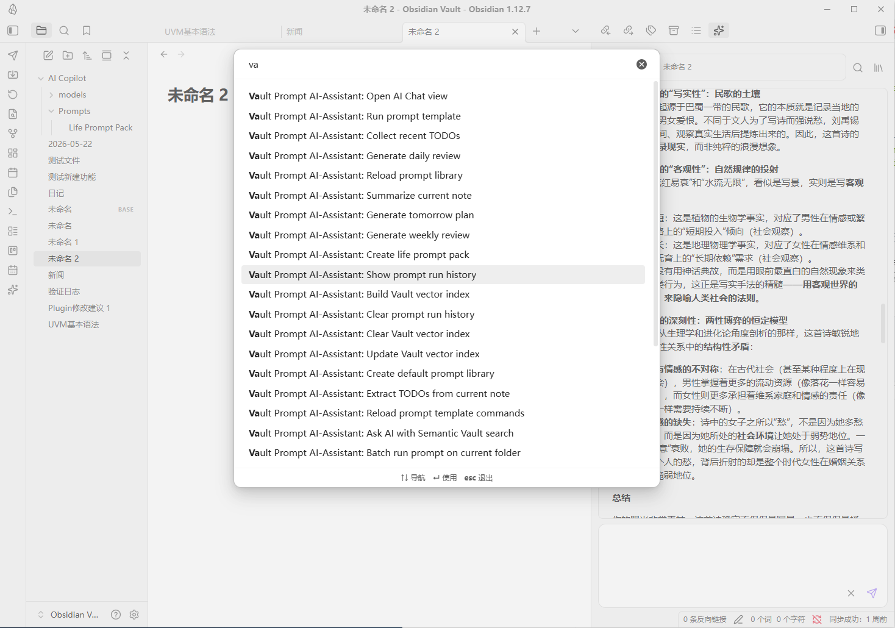
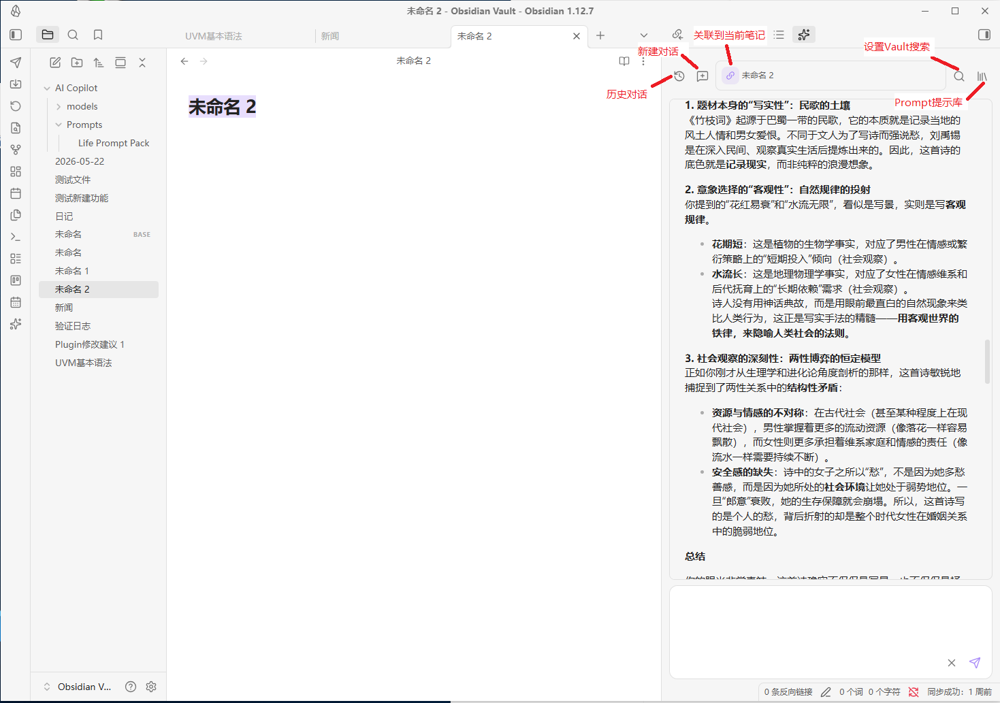
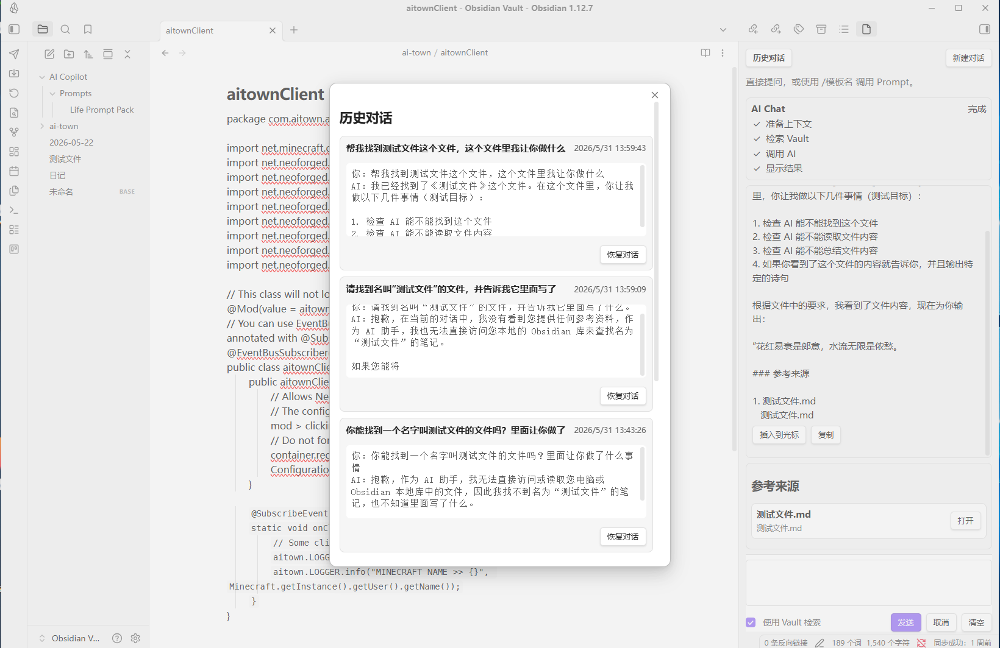
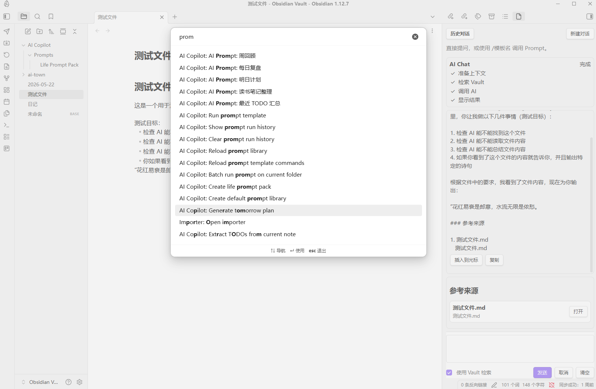

# Prompt AI Assistant

Magic Wand AI Assistant is an Obsidian plugin providing an AI assistant with features such as Chat interaction, Vault search, RAG semantic Q&A, Prompt Library, Daily Note workflow, batch prompts, conversation history, and AI response insertion into notes.

Current stable version: `1.8.1`

Note: Currently tested only on desktop. The vector index feature is untested; current Vault search uses keyword matching.

## Core Features

### 1. AI Chat

#### 1. Sidebar

The plugin adds a right-side Chat panel for conversations with the AI.

#### 2. Conversation History

Click "Conversation History" at the top of the Chat panel to view recent chats.

#### 3. Vault Search

Enabling:
Use Vault Search
The plugin will attempt to find related content in the current Vault and provide an AI answer.

Search order:
1. Vector index is used first (if available).
2. If no index or if retrieval fails, falls back to keyword search.
3. Filename matches take priority.
4. Path matches.
5. Content keyword matches.

#### 4. Simplified Reference Display

The references area in Chat only shows:

- Filename
- Relative path
- Open button

### 2. Prompt Library

The plugin supports text-based prompt templates.

- Default prompt file: AI Copilot/Prompts.md
- Folder mode also supported: AI Copilot/Prompts/
- In Chat, you can type: `/prompt name`

#### 1. Daily Life Prompt Pack

Built-in templates for daily life scenarios include:

- Daily review
- Tomorrow’s plan
- Weekly review
- Recent TODO summary
- Book note organization
- Study plan
- Fitness summary
- Spending analysis
- Emotion journal sorting
- Travel planning

## Recommended Usage Flow

### First Use

1. Install the plugin
2. Configure API Key
3. Set up AI model
4. Open the AI Chat view
5. Send a basic question
6. Create the Prompt Library
7. Build Vault vector index (optional, untested)
8. Enable `Use Vault Search`
9. Test Vault Q&A
